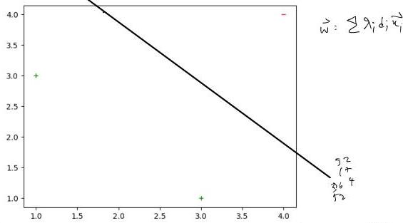
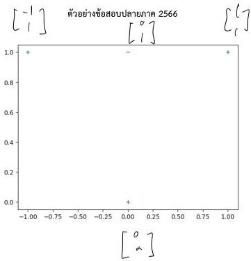
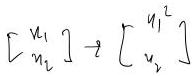
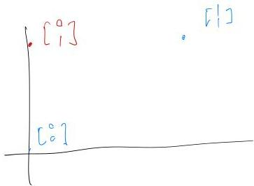
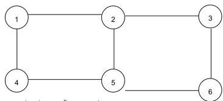
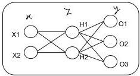

1. กำหนดให้มีข้อมูลอินพุตเป็นดังรูป มีตัวอย่างบวกที่เป็น support vector ที่จุด x1 (1,3) และ x2 (3,1) และตัวอย่างลบที่เป็น support vector ที่จุด x3 (4,4) ให้หาค่า Lagrange multiplier ของทั้งสามจุด แสดงวิธีทำอย่างละเอียด และหาค่า w จากผลที่ได้

$$
\vec{w} = \lambda_1(1) \begin{bmatrix} 1 \\ 3 \end{bmatrix} + \lambda_2(1) \begin{bmatrix} 1 \\ 3 \end{bmatrix} + \lambda_3(-1) \begin{bmatrix} 1 \\ 4 \end{bmatrix}
$$

$$
= \begin{bmatrix} \lambda_1 + \lambda_2 - \lambda_3 \\ \lambda_1 + 3\lambda_2 - 4\lambda_3 \\ 3\lambda_1 + \lambda_2 - 4\lambda_3 \end{bmatrix}
$$

$$
18\lambda_1 - 17\lambda_3 = 1 \\
34\lambda_1 - 77\lambda_3 = -1 \\
52\lambda_1 = 50\lambda_3
$$

$$
\vec{w} \cdot \vec{x_1} = 1
$$

$$
11\lambda_1 + 7\lambda_2 - 17\lambda_3 = 1
$$

$$
\Rightarrow \quad \lambda_1 = \lambda_2 = \frac{50}{16}
$$

$$
\vec{w} \cdot \vec{x_2} = 1
$$

$$
7\lambda_1 + 11\lambda_2 - 12\lambda_3 = 1
$$

$$
x_3 = \frac{52}{16}
$$

$$
\vec{w} \cdot \vec{x_3} = -1
$$

$$
17\lambda_1 + 12\lambda_2 - 37\lambda_3 = -1
$$

$$
\vec{W} = \left[ \begin{array}{cc} 2 \pi_1 - \lambda_1 &amp; \\ 4 &amp; -4 \\ 4 &amp; -4 \end{array} \right] = \left[ \begin{array}{c} 3 \\ -1/2 \\ -1/2 \end{array} \right]
$$

2. จากการกระจายตัวของตัวอย่างด้านล่าง ให้เลือกฟังก์ชันการแปลงตัวอย่างจากปริภูมิสองมิติในรูป ไปเป็นปริภูมิใหม่ ในกี่มิติก็ได้ จากนั้นให้แสดงการกระจายตัวของตัวอย่างในปริภูมิใหม่ที่สามารถแยกได้ด้วยเส้นตรง

(6 คะแนน)

3. กำหนดให้โครงสร้างในชั้น Kohonen เป็นดังรูปด้านล่าง โดยเส้นเชื่อมหมายถึงการเป็นเพื่อนบ้านกันของโหนดแต่ละอัน และกำหนดให้ในการปรับ weight เพื่อนบ้านจะถูกปรับ weight เท่ากับ winning neuron ทุกครั้ง ส่วนโหนดที่ไม่ได้เป็น เพื่อนบ้านกับ winning neuron จะไม่ได้รับการปรับ weight

4

กำหนดให้ค่าน้ำหนักเริ่มต้นของเส้นเชื่อมที่โยงจากชั้นอินพุต (ซึ่งประกอบด้วยอินพุตสองตัว) มีค่าเท่ากับตัวเลขประจำโหนด เช่น โหนด 1 จะมี weight เป็น (1,1) โหนด 2 จะมี weight เป็น (2,2) ตามลำดับ และกำหนดให้ค่า learning rate มีค่าเท่ากับ 0.5 ให้นิสิตแสดงการ Train SOM เมื่อรับตัวอย่าง 3 ตัวดังนี้ (1,1), (2,4) และ (5,3) ในกรณีที่มี winning neuron มากกว่าหนึ่งตัว ให้ถือว่าตัวที่มีเลขประจำโหนดน้อยกว่า เป็นผู้ชนะ

$$
\vec{w}_1 = \left[ \frac{1}{2} \right] + 0.5 \left[ \frac{-1}{1} \right] = \left[ \frac{1.5}{1.5} \right]
$$

$$
\vec{w}_4 = \left[ \frac{4}{4} \right] + 0.5 \left[ \frac{-3}{-3} \right] = \left[ \frac{2.5}{2.5} \right]
$$

$$
\left[ \frac{2}{4} \right] \quad \text{node } 3 \quad \vec{w}_3 = \left[ \frac{1}{1} \right] + 0.5 \left[ \frac{-1}{1} \right] = \left[ \frac{2.5}{3.5} \right]
$$

$$
\vec{w}_2 = \left[ \frac{1.5}{1.5} \right] + 0.5 \left[ \frac{0.5}{2.5} \right] = \left[ \frac{1.75}{2.75} \right]
$$

$$
\vec{w}_6 = \left[ \frac{6}{6} \right] + 0.5 \left[ \frac{-4}{-2} \right] = \left[ \frac{4}{5} \right]
$$

$$
\left[ \frac{5}{3} \right] \quad \text{node } 5 \quad \vec{w}_5 = \left[ \frac{5}{5} \right] + 0.5 \left[ \frac{0}{-2} \right] = \left[ \frac{5}{4} \right]
$$

$$
\vec{w}_2 = \left[ \frac{3.375}{2.875} \right]
$$

$$
\vec{w}_4 = \left[ \frac{3.75}{2.75} \right]
$$

$$
\vec{w}_6 = \left[ \frac{4.5}{4} \right]
$$

5

4. ให้แสดงผลที่ได้จากแต่ละชั้นใน CNN ที่รับอินพุตเป็นเมทริกซ์ขนาด 5x5 ตามตารางด้านล่าง

|  84 | 59 | 5 | 64 | 57 | 20  |
| --- | --- | --- | --- | --- | --- |
|  97 | 66 | 36 | 80 | 57 | 12  |
|  65 | 66 | 21 | 94 | 100 | 40  |
|  81 | 27 | 55 | 85 | 28 | 18  |
|  7 | 95 | 76 | 33 | 76 | 42  |
|  1 | 12 | 73 | 20 | 87 | 32  |

- กำหนดให้มี kernel ที่มี weight ตามรูปด้านล่าง จะได้ผลลัพธ์จากการทำ convolution เป็นอย่างไร

|  1 | 1 | 1  |
| --- | --- | --- |
|  1 | 5 | 1  |
|  1 | 1 | 1  |

w+f

- ผลลัพธ์จากการทำ max pooling ในขนาด 2x2 จะเป็นอย่างไร

_________________________(8 คะแนน)

7

Initialize all weights to small random numbers.

Until satisfied, Do

- For each training example, Do

1. Input the training example to the network and compute the network outputs
2. For each output unit $k$

$$
\delta_k \leftarrow o_k (1 - o_k) (t_k - o_k)
$$

3. For each hidden unit $h$

$$
\delta_h \leftarrow o_h (1 - o_h) \sum_{k \in outputs} w_{h,k} \delta_k
$$

4. Update each network weight $w_{i,j}$

$$
w_{i,j} \leftarrow w_{i,j} + \Delta w_{i,j}
$$

where

$$
\Delta w_{i,j} = \eta \delta_j x_{i,j}
$$

กำหนดให้โครงสร้างของนิวรอลเน็ตเวิร์กเป็นรูปด้านล่างดังนี้ โดยชั้นอินพุตเป็น Linear neuron ส่วนชั้น Hidden และชั้นเอาต์พุตเป็น Sigmoid unit โดยกำหนดให้ค่าเริ่มต้นของแต่ละ node เป็นดังนี้ (เรียง W0,W1,W2) H1=[0.1,0.1,0.2], H2=[-0.1,0.1,0.1] และ (เรียง W0,W1,W2) O1=[0.1,-0.1,0.1], O2=[0.2,0.1,0.1] และ O3=[-0.1,0.1,-0.2] ให้ Learning Rate = 0.1 และไม่ใช้ค่าโมเมนตัม

ตัวอย่างแรก:

|  Input |   | Output  |   |   |
| --- | --- | --- | --- | --- |
|  X1 | X2 | O1 | O2 | O3  |
|  1 | 1 | 0.8 | 0.2 | 0.2  |

$$
\begin{array}{l}
\text{forward} \quad z_1 = [1, 1, 2] \cdot [0.1, 0.1, 0.2] = 0.6 \quad \delta(z_1) = 0.65 \\
\quad z_2: [1, 1, 2] \cdot [-0.1, 0.1, 0.1] = 0.2 \quad \delta(z_2) = 0.55 \\
\quad y_1: [1, 0.65, 0.55] \cdot [0.1, -0.1, 0.1] = 0.09 \quad \delta = 0.52 \\
\quad y_2: \quad [0.2, 0.1, 0.1] = 0.32 \quad = 0.58 \\
\quad y_3: \quad [-0.1, 0.1, -0.2] = -0.145 \quad = 0.46 \\
\end{array}
$$

$$
\begin{array}{l}
\delta \theta_1 = 0.52 (1 - 0.52)(0.8 - 0.52) = 0.07 \quad \delta z_1 = 0.68 (1 - 0.55) \\
\quad \quad \quad \quad \quad \quad \quad \quad \quad \quad \quad \quad \quad \quad \quad \quad \quad \quad \quad \quad \quad \quad \quad \quad \quad \quad \quad \quad \quad \quad \quad \quad \quad \quad [-0.1 \delta \theta_1 + 0.1 \delta \theta_2 + 0.1 \delta \theta_3] \\
\delta \theta_2: \\
\end{array}
$$

$$
\begin{array}{l}
\text{H1:} \quad W0 = \dots, W1 = \dots, W2 = \dots \\
\text{H2:} \quad W0 = \dots, W1 = \dots, W2 = \dots \\
\text{O1:} \quad W0 = \dots, W1 = \dots, W2 = \dots \\
\text{O2:} \quad W0 = \dots, W1 = \dots, W2 = \dots \\
\text{O3:} \quad W0 = \dots, W1 = \dots, W2 = \dots \\
\end{array}
$$

$$
W0 = \left[0.1, -0.1, 0.1\right] + (0.1)(0.07) \left[1, 0.65, 0.55\right]
$$

ตัวอย่างที่สอง:

|  Input |   | Output  |   |   |
| --- | --- | --- | --- | --- |
|  X1 | X2 | O1 | O2 | O3  |
|  0.1 | 1 | 0.8 | 0.8 | 0.8  |

H1: W0 = ..., W1 = ..., W2 = ...
H2: W0 = ..., W1 = ..., W2 = ...
O1: W0 = ..., W1 = ..., W2 = ...
O2: W0 = ..., W1 = ..., W2 = ...
O3: W0 = ..., W1 = ..., W2 = ...